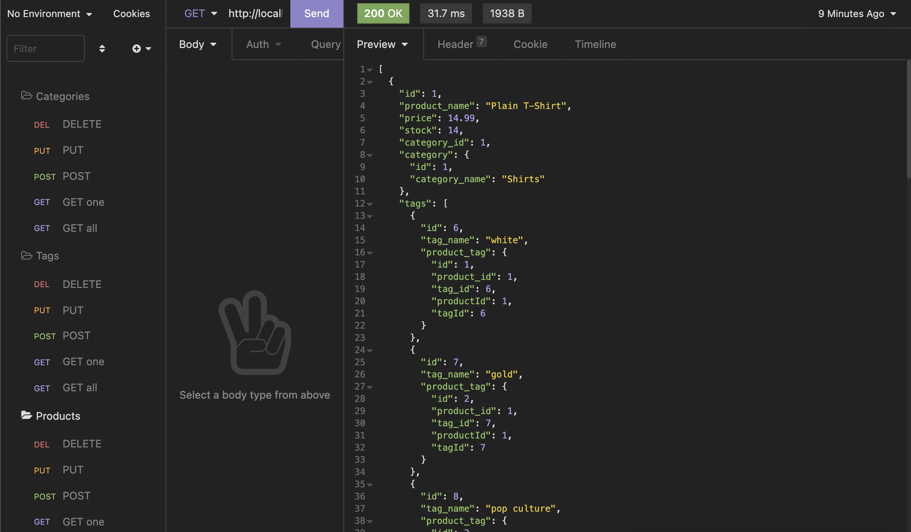

# Ecommerce Back End

## Description

Customers need ways to track items they are selling and all the information that needs to be attached to them so they can easily and quickly access it with a well designed front end interface. Being able to accurately store this information is crucial to being able to run a successful buisiness.

## Table of Contents

- [Installation](#installation)
- [Usage](#usage)
- [Tests](#tests)
- [Contributing](#contributing)
- [License](#license)
- [Link](#link)
- [Screenshot](#screenshot)
- [Questions](#questions)

## Installation

    npm i

## Usage

node index.js

## Tests

No tests have been written for this application, however feel free to write some and test away!

## Contributing

Please follow the guidlines defined in the Contributors Covenant.

## License

This project is licensed under the MIT license. (c) 2022

## Link

https://drive.google.com/file/d/19KcwMpC6bvP1vgyQSk2UvkPUgA5FKjva/view?usp=sharing

## Screenshot

## Questions

#### If you have questions or would like to contact me for more information, you can find me on Git Hub or send me and email.

- https://github.com/elliscj
- elliscj@colorado.edu
